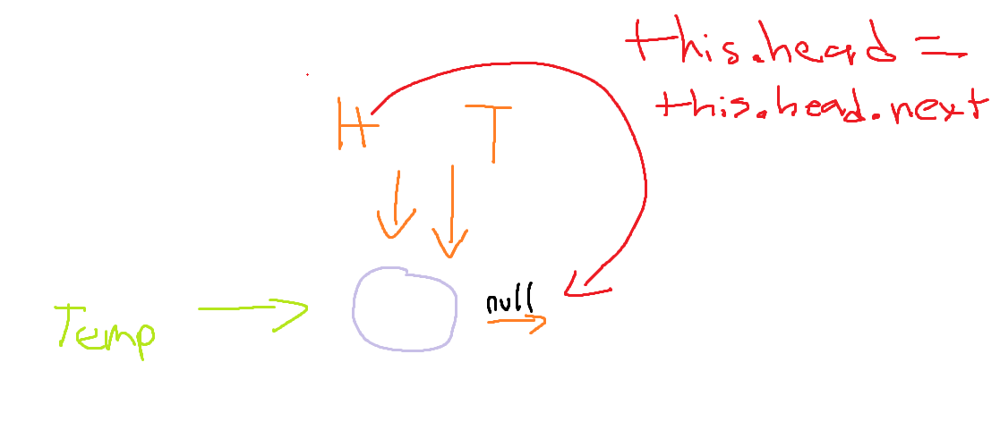

# Linked List

Linked lists do not have indexes unlike arrays
Linked lists are all over the place in memory where as arrays are in contiguous place
Linked lists have a variable called head and tail.

- head points to the first item whereas tail points to the last

Each item in the linked list points to the next, to the next to, to the next

- the last item points to null. This is called a **null terminated list**


## Linked Lists Big O


### Adding and removing to the end

Pushing onto the end is O(1) because:

1. We have the last item point to the new node instead of null
2. We set tail equal to that very same pointer

Popping off of the end is O(n) because:

1. We cannot simply have the tail point back to the previous node and nothing is indexed!
2. We have to iterate through the entire list again and find the POINTER pointing ot the last item and have tail set equal to that

### Adding and removing to the beginning

Shifting from the front is O(1) because:

1. We set head equal to the first node's next pointer i.e head = head.next.
2. Then we remove a node from a beginning by setting its next to null

Unifting onto the front is O(1) because:

1. We set the new nodes next property to head.next
2. We set head to the new node, thereby adding it into the list

### Inserting

Inserting and Deleteing are O(n) because:

1. We set the inserted nodes pointer to the same node its predecessor is pointing to ( or in reverse for deleting)
2. We set the previous nodes pointer to the newly inserted node (removing in the case of deleting)
3. O(n) because we had to iterate through the linked list to accomplish this

### Finding

We can find by value or index, This is O(n) b/c we iterate through as linked lists dont have index's by default

## Under the hood

What is a node in a linked list?

```
let node = { value: 4, next: null}
```

> Nodes are both the VALUE and the POINTER aka an OBJECT!

How then do we have the NEXT value pointing at another node? Simple!

```
let linkedList = {
	head: {
		value: 7,
		next: {
			value: 4,
			next: { value: 23, next: null },
		},
	},
};
```


> image to show where we point tail as its difficult to add it into the code for now
> we set tail equal to the **next** value of the 4 node which points it to the last node in the linked list

## Constructor for linked list

The constructor has things in common with push, unshift, and insert

1. Each recieve and value
2. They create a new node

```
class LinkedList {
	constructor(value) {
        //create new node
        const newNode = new Node(value);
		this.head = newNode;
		this.tail = newNode;
		//this.tail = this.head
        // tail = head  is the same as tail & head = newNode this approach is just emphasizing that there is only ONE node
        //and that tail and head are pointing to the same node
		this.length = 1;
    }
	push(value) {
        //creates new node and adds it to the end
    }
	unshift(value) {
        //creates new node and adds it to the beginning
    }
	insert(index, value) {
        //creates nwe node and inserts it
    }
}

let myLinkedList = new LinkedList(4)
```

> we dont want to repeat this create new node code 4 differt times
> Therefore we should create a seperate class for creating nodes

### Node class for DRY code - aka dont repeat yourself

```
class Node {
	constructor(value) {
		this.value = value;
		this.next = null;
	}
}

```

<mark>When we need to create a new node we'll just call this class</mark>

### Push method of Linked List

Add node to end of the list

1. create new node
2. handle edge case of a linked list with no nodes
   a. Head points to new node
   b. Tail points to new node
3. have the last node point to the new node
4. have tail point to new node which is now the last node

```
	push(value) {
		const newPushedNode = new Node(value);
		//edge case - what if this is a linked list with no nodes?
		if (!this.head) {
			this.head = newPushedNode;
			this.tail = newPushedNode;
		} else {
		//This sets the last item's next proeprty to the new node!
			this.tail.next = newPushedNode;
		//This moves the tail variable to point at the newly created LAST node
			this.tail = newPushedNode;
		}
		this.length++;
		return this;
	}
```

> Remember the **tail** variable always points at the last node, so FIRSt we have to set the last node's next proeprty to the new node. THEN we set the tail to now point at the new last node

### Pop

Remove the last item

1. remove item from end
2. move tail to previous item
3. return item we removed

Edge cases:

1. No items in the list
   a. return undefined
2. One item in the list

How to get to and track the current last node and the node previous to it:


1. We must iterate through the list (that's why this operation is O(n))
2. Temp variable will point at the last node - 4
3. Pre variable will point to the previous node - 23

```
pop() {
		if (!this.head) return undefined;
		let temp = this.head,
			pre = this.head;
		while (temp.next) {
			pre = temp;
			temp = temp.next;
		}
		this.tail = pre;
		this.tail.next = null;
		this.length--;
		if (this.length === 0) {
			this.head = null;
			this.tail = null;
		}
		return temp;
	}

```

### Unshift

Add a new node to the beginning of the list

1. Crate new node
2. Have that new node point at the first node in the linked lsit
3. Head now should be set equal to new node

Edge Case:

1. If list is empty
   a. set head to new node
   b. set tail to new node

```
unshift(value) {
		const newNode = new Node(value);
		if (!this.head) {
			this.head = newNode;
			this.tail = newNode;
		} else {
			newNode.next = this.head;
			this.head = newNode;
			this.length++;
		}
		return this;
	}
```

### Shift

Removing the first node

1. Move head over to the next node
2. Remove first node
3. return removed node

Edge Cases:

1. Only 1 item in list
2. No items in linked list

```
shift() {
		if (!this.head) return undefined;
		let temp = this.head;
		this.head = this.head.next;
		temp.next = null;
		this.length--;
		if (this.length === 0) {
			this.tail = null;
		}
		return temp;
	}

let myLinkedList = new LinkedList(2);
myLinkedList.push(1);
console.log(myLinkedList);
myLinkedList.shift();
console.log(myLinkedList);
myLinkedList.shift();
console.log(myLinkedList);
let item = myLinkedList.shift();
console.log(item);
```



> Setting temp.next to null deletes the connection to the entire linked list
> You'll notice that this.head is not being set to null in the last IF CHECK b/c head will already be null since there is only one item and this.head = this.head.next is run previous which sets head to null inherently

### Get

Searching for a node by index
Edge Case:

1. We cannot get an index greater than the length and we cannot get anything less than 0

```
	get(index) {
		if (index < 0 || index >= this.length) return undefined;
		let temp = this.head;
		for (let i = 0; i < index; i++) {
			temp = temp.next;
		}
		return temp;
	}
```

> If we always set temp to temp.next then once our desired index is met, we will recieve the pointer to the node at the desired index

### Set

Go to an index and change the value of the item at that index

Hint: Use the get method!

```
	set(index, value) {
		let temp = this.get(index);
		if (temp) {
			temp.value = value;
			return true;
		}
		return false;
	}
```

### Insert

Insert a new node at a particular index

Edge Cases

1. Insert at index of 0 AKA unshift
2. Insert at the last index AKA POP
3. If the index does not work aka greater than length or less than 0 return false

```
	insert(index, value) {
		// we retun b/c we want to return what these methods return AND stop running code
		if (index === 0) return this.unshift(value);
		if (index === this.length) return this.push(value);
		if (index < 0 || index > this.length) return false;
		const newNode = new Node(value);
		const temp = this.get(index - 1);
		newNode.next = temp.next;
		this.length++;
		temp.next = newNode;
		return true;
	}

```


### Remove

Remove a node at a specific index

Edge Cases:

1. At a bad index

```
	remove(index) {
		if (index === 0) return this.shift();
		if (index === this.length - 1) return this.pop();
		if (index < 0 || index >= this.length) return undefined;
		const pre = this.get(index - 1);
		const temp = pre.next;
		pre.next = temp.next;
		temp.next = null;
		this.length--;
		return temp;
	}

```


### Reverse

Reverse the linked list

```
reverse() {
		let temp = this.head;
		this.head = this.tail;
		this.tail = temp;
		let next = temp.next;
		let prev = null;
		for (let i = 0; i < this.length; i++) {
			next = temp.next;
			temp.next = prev;
			prev = temp;
			temp = next;
		}
		return this;
	}


```

> We need three variables, temp, previous, and next.
> head and tail must be swapped - this is the easy part!
> then we slowly crawl through the linked list and move all three variables to the following pointers
